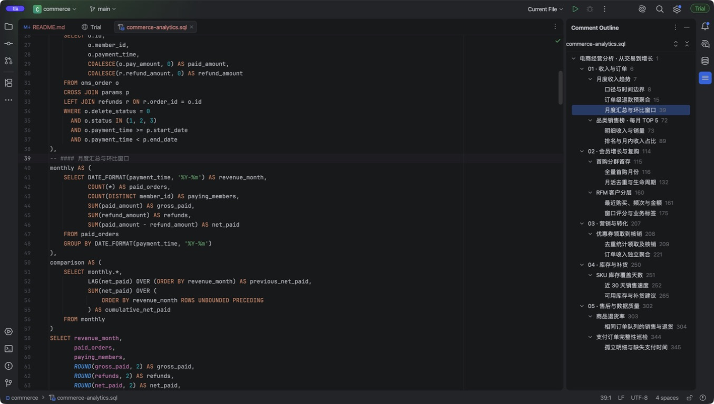
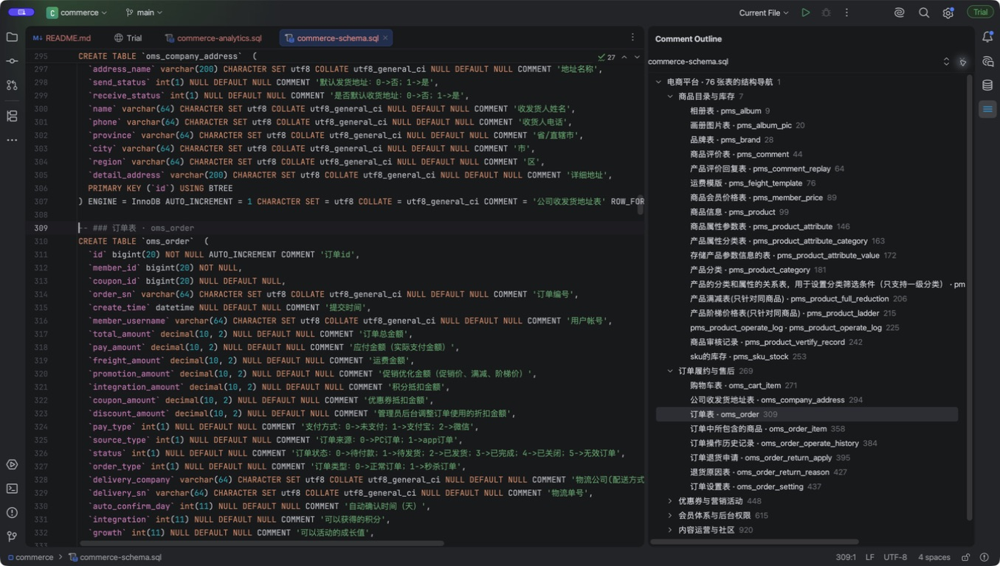
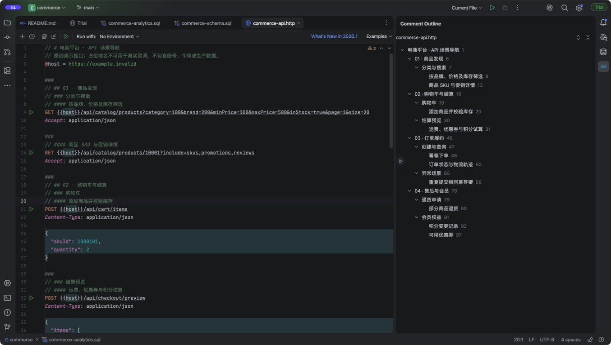

# Code Comment Navigator — SQL / HTTP 注释大纲

在 IntelliJ IDEA 右侧显示当前 `.sql`、`.http`、`.rest` 文件的注释目录。适用于项目文件和 Scratches 中不断增长的迭代脚本。

## 免费与开源

本项目采用 **MIT License**，个人和企业均可免费使用，包括商业用途，无需购买、订阅或激活码。允许修改、再分发及销售，须按许可要求保留版权及许可声明。

完整条款见 [LICENSE.txt](LICENSE.txt)，安装包内同时附带该文件。软件按现状提供，不承诺固定更新周期或支持响应时间。

[项目网站](https://commentnavigation.plugins.topxup.com) · [源代码](https://github.com/fuuqiu/CommentNavigation) · [问题反馈](https://github.com/fuuqiu/CommentNavigation/issues) · 邮箱：fuuqiu@gmail.com

[插件隐私说明](PRIVACY.md)：目录在 IDE 本地生成，不上传文档内容，无遥测或广告。

## 使用

1. 安装插件并打开 SQL / HTTP 文件。
2. 点击右侧 **Comment Outline**，或通过 **View → Tool Windows → Comment Outline** 打开。
3. 使用 `#` 到 `######` 标记标题层级；点击标题即可跳转到对应注释行。

面板跟随当前编辑器，修改后约 250 ms 自动更新，不需要保存。支持折叠/展开、全部展开/折叠、在树中直接输入标题搜索，以及上下键选择、Enter 跳转。同一文件编辑时保留折叠状态；切换文件默认展开。空文件及不支持的文件会清空目录。

编辑器右键或 Edit 菜单中的 **Comment Structure** 也可打开大纲。原有 Java / Kotlin 注释弹窗保留。

界面语言跟随 IDEA 的显示语言（中文或英文，其他语言使用英文），颜色和图标跟随 IDE 的明亮 / 暗黑主题。

### 搜索当前文件大纲

顶部以灰色显示当前文件名，点击后切换成大纲搜索框。输入标题关键词即时过滤，不区分大小写，保留匹配标题的父级路径；父标题匹配时保留整组子标题。上下键选择、Enter 跳转，Esc 清空搜索并恢复文件名。切换文件自动清空大纲搜索，与底部文件名搜索互不影响。

### 快速切换 Scratch 文件

点击面板底部独立的 **Scratches** 标题栏，展开 **Scratches 目录树和搜索框**（与面板等宽，不悬浮），上方继续显示当前文件的注释大纲。两个区域独立滚动，可拖动中间分隔线调整高度。目录树直接显示 **Scratches** 内部的目录和文件，不再显示最外层根节点。可浏览其中的 `.http` 和 `.sql` 文件（不区分扩展名大小写，不显示 `.rest` 或其他类型）。支持子目录和同名文件；以 `.` 开头的文件夹（如 `.git`、`.idea`）及其内容会被忽略，也不会出现在搜索结果中。

- 搜索框固定在面板底部。输入文件名片段快速筛选，例如 `shop` 可匹配 `my-shop.sql` 和 `SHOP-api.http`，不区分大小写。
- Scratches 中右键 SQL / HTTP 文件选择 **重命名**，或选中文件后按 **F2**。输入包含 `.sql` / `.http` 后缀的新文件名，Enter 确认、Esc 取消；同名文件不会被覆盖。重命名后同步更新文件树和当前大纲文件名。
- 单击文件即可打开；也可在搜索框中用上下键选择、Enter 打开，Esc 关闭。
- 拖拽文件到目标文件夹即可实际移动文件；拖到列表底部空白处可移回 Scratches 根目录。同名冲突会提示，不覆盖文件。暂不拖动整个文件夹。
- 选择目录后，点击底部目录标题栏右侧 **＋**，在面板内填写名称：**orders.sql** 创建 SQL 文件，**api.http** 创建 HTTP 文件，**orders** 创建文件夹。选择文件时默认在其所属目录中新建；点击列表空白处取消选择后在 Scratches 根目录新建。其他后缀不接受。
- 新文件自动添加注释标题模板并在编辑器打开，创建文件夹后留在面板继续操作。仅创建文件，不执行 SQL 或 HTTP 请求。
- 搜索只过滤文件，保留全部目录（包括空目录）作为移动目标；可直接把搜索结果拖入文件夹，无需清空关键词，移动后仍保持搜索结果。文件夹整行均可接收拖放。目录在前、文件在后，按名称展示。
- 点击文件或按 Enter 打开后，上方大纲更新，底部目录树和搜索条件保持；再次点击底部 **Scratches** 标题栏或在底部区域按 Esc 可收起文件列表。新建时按 Esc 先取消新建。
- 每次展开异步刷新磁盘与文件列表；删除或新增文件后重新展开即可更新。即使当前没有打开支持的文件，也能通过 **Scratches** 按钮进入。

## AI 生成规范

落地页的一键复制与下载提供同一份中英文 Skill。规范要求用少量显式标题替代装饰横线、重复目录与逐句解说；保留必要业务口径与风险提示，并确保 HTTP 下一组标题位于新的 `###` 之后。

- [中文 Skill](site/public/skills/zh/comment-navigator/SKILL.md)
- [English Skill](site/public/skills/en/comment-navigator/SKILL.md)

## 标题写法

### SQL

```sql
-- # 角色与权限核对
-- ## 角色本体
-- ### 系统模板
SELECT 'system role';

-- ### 商户角色
SELECT 'merchant role';

-- ## 授权明细
/*
 * ### 页面权限
 * #### PRO 页面
 */
SELECT 'page permission';
```

支持 `--`、MySQL `#` 行注释及 `/* ... */` 块注释中的 Markdown 标题。标题必须独占注释行；不提取 SQL 语句行尾注释、字符串或引用标识符中的伪标题。

MySQL 方言下，IDE 默认生成的 `# 查询角色权限` 会在没有显式标题时作为普通注释显示。需要层级时，使用 `# # 角色核对`、`# ## 权限明细`：第一个 `#` 是 SQL 注释符，其后的 `#` 才表示标题级别。有显式标题时仍只展示标题，普通说明不进入大纲。

### HTTP

推荐用 `//` 注释书写标题，也支持 `#` 注释后再加 Markdown 标题：

```http
// # 货柜查询
// ## 正常场景
# ### 响应字段核对

### 批量查询货柜
GET {{host}}/freezers

// # 补货单
### 补货单详情
GET {{host}}/replenishments/example
```

| 写法 | 大纲层级 |
| --- | --- |
| `// # 标题` 或 `# # 标题` | 一级 |
| `// ## 标题` 或 `# ## 标题` | 二级 |
| `// ### 标题` 或 `# ### 标题` | 三级 |
| `### 请求名称` | 二级，兼容 HTTP Client 原有请求分隔符 |

HTTP 的 `### 请求名称` 固定视为二级节点，因此不要用它表达三级标题。需要严格控制层级时使用 `// ### 标题` 等明确写法。空的 `###` 不进入目录；请求前置和响应处理脚本中的注释不进入目录。

标题标记后须留空格，支持 1–6 级。跳级时挂在前一个层级更浅的标题下，同级标题保持文件顺序。普通说明不会混入显式标题大纲；整个文件没有任何标题或请求名称时，回退到普通注释的平级列表。

可直接打开 [SQL 示例](examples/comment-outline.sql) 和 [HTTP 示例](examples/comment-outline.http) 体验层级目录。示例不包含真实业务地址或数据。

## 大型电商示例

[电商示例目录](examples/commerce/README.md) 提供 76 张表、1,068 行的完整结构导航，以及 363 行、8 个独立查询的经营分析 SQL。覆盖收入环比、品类排名、会员留存、RFM 分群、优惠券、补货和售后，另有分层 HTTP 场景。

建表结构派生自 Apache-2.0 许可的 `macrozheng/mall`，随附来源、修改说明与完整上游许可；原创分析及 HTTP 示例适用 MIT。

### 实际效果







## 构建与安装

兼容范围为 **IntelliJ IDEA 2025.1–2026.2（251–262.*）**。默认使用 2025.1 SDK 编译，输出 Java 21 字节码；构建工具使用 **JDK 21**，Kotlin API / 语言版本限制为 2.1。解析使用平台 Document API，无需 SQL / HTTP 语言插件依赖。

```bash
./gradlew test buildPlugin
```

日常开发可通过 `-PlocalIdePath` 复用本机 SDK；发布前应使用默认 2025.1 基线构建，避免误用新版 API：

```bash
IDEA_HOME='/path/to/IntelliJ IDEA.app/Contents'
JAVA_HOME="/path/to/jdk-21/Contents/Home" \
  ./gradlew test buildPlugin \
  "-PlocalIdePath=$IDEA_HOME"
```

安装包位于 `build/distributions/comment-navigation-1.2.2.zip`。在 IDEA 的 **Settings → Plugins → 齿轮菜单 → Install Plugin from Disk…** 中选择 ZIP，并按 IDE 提示完成安装。

开发时运行 `./gradlew runIde`（可加上述 `-PlocalIdePath` 参数）会使用 Gradle 插件的隔离沙箱，不使用个人 IDEA 配置。

兼容性验证（默认检查构建基线，可附加本机新版 IDE）：

```bash
./gradlew verifyPlugin "-PverificationIdePath=/path/to/IntelliJ IDEA.app/Contents"
```
